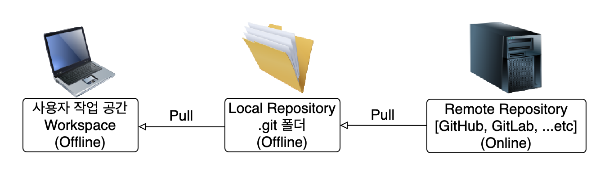

# Git Flow

## <U>Commit</U>
### Workspace에 있는 파일을 Local Repository로 이동
```bash
$ git commit
```

## <U>Push</U>
### Local Repository에 있는 파일을 Remote Repository으로 이동
```bash
$ git push <remoteName> <branchName>
```

## <U>Pull</U>
### 원격저장소의 파일을 받음
Pull 명령어로 Local Repository와 Workspace 두 곳에 다 저장 된다
```bash
$ git pull <remoteName> <branchName>
```

> ## 이미지 참고
> ### Workspace에서 Remote Repository까지 이동
>
> ### Remote Repository에서 Workspace까지 이동
> 