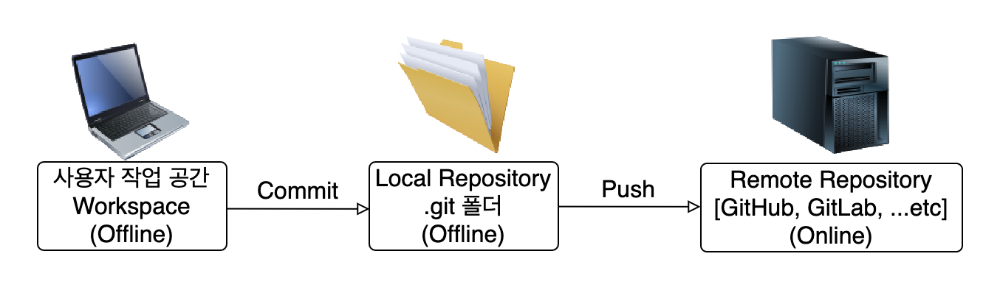

# Git이 SVN보다 나은 점

## History 복구
### - SVN은 중앙 서버가 날라갈 경우 복구가 불가하다.
### - Git은 최신 History를 가진 사람이 Push 할 경우 Hisotry 복구가 가능하다.

## Commit 속도
### - 커밋 내역이 많아질 경우 Git이 SVN보다 속도가 더 빠르다.

## 협업 시 충돌 관리 용이
### - SVN은 Commit 하자마자 Remote Repository로 이동되어 모든 사람에게 공유되지만, 만약 같은 파일을 수정 시 충돌 해결이 어려울 수 있다.
### - Git은 Commit을 하면 Local Repository로 이동 한 상태에서 충돌 상태를 해결하고 Push 하여 Remote Rpeository로 이동하는 2단계로 충돌 해결이 좀 더 용이하다.  

## 백업 저장소 존재
### - SVN은 Remote Repository 하나만 존재하여 원격 저장소에서 문제가 생길 시 Workspace에 있는 자료로만 복구가 가능하여 파일이 유실 될 가능성이 높다. 
### - Git은 Local Repository, Remote Repositry 두 개가 있어 Remote Repository에 문제가 생길 시 Local Repository에 저장 된 히스토리 및 파일로 복구가 용이하다.

> ## 참고 이미지
> ### Git과 SVN이 파일을 저장하는 과정
> ### - SVN
> 
> ### - Git
> 