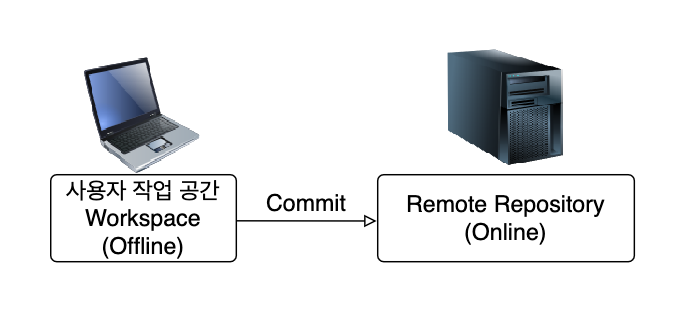

## Git과 SVN의 차이점
|          | SVN                                             | Git                                                 |
|----------|-------------------------------------------------|-----------------------------------------------------|
| 사용법      | 간편하고 어렵지 않음                                     | 다소 복잡하고 초보자가 이해하기 어려움                               |
| 기능       | 버전관리에 최적화된 간편한 기능                               | 버전관리에 필요한 모든 기능이 존재                                 |
| 프로세스     | 중앙 집중식                                          | 분산 관리식                                              |
| 소스 충돌 위험 | 매우 높음                                           | 권한 설정을 통해 충돌 위험 감소                                  |
| 소스 복구 여부 | 만약 원격 저장소가 데이터가 없어지고 로컬 PC의 파일도 없어진 경우 소스 복구 불가 | 최신 History가 있는 로컬 저장소만 있으면 원격 저장소가 없어져도 복구가 언제든지 가능 |
| 코드 분산 관리 | 관리의 한계가 존재                                      | 수백~수천의 프로그래머의 분산 작업에도 매우 용이                         |
| 작업 내용 복구 | 다소 불편함                                          | 예전 버전으로 복구가 매우 편리                                   |
| 브랜치 생성   | 다소 불편함                                          | 로컬에서 브랜치 생성 및 태그 생성이 매우 편리함                         |

---

## Git이 SVN보다 어려운 이유

 

### 진입 장벽이 높다
#### - SVN은 Git에 비해 직관적이여서 초기 진입 장벽이 낮다.
#### - Git은 명령어가 SVN의 명령어에 비해 더 많아 익숙해지는 것이 어렵다. 다만, 명령어가 많은 만큼 버전 관리를 좀 더 전문적으로 할 수 있다.

 

### 사용 방법이 복잡하다
#### - SVN은 작업한 내용을 Commit만 하면 바로 Remote Repository로 저장되어 다른 사용자들에게 공유되는 편리함을 가지고 있다.
#### - Git은 Local Repository로 저장 후 추가로 명령어를 입력하여 Remote Repository로 저장 되는 구조로 되어 있어 처음에는 불편함을 느낄 수 있다.

 

### SI에서는 SVN을 많이 사용하여 Git이 익숙하지 않다
#### - 상당수의 SI에서는 Git보다는 SVN을 많이 사용하여 SVN에 익숙해진 개발자들이 많아서 익숙하지 않은 Git을 어려워 하는 개발자들이 많다.

---

## Git이 SVN보다 나은 점

 

### <U>History 복구</U>
#### - SVN은 중앙 서버가 날라갈 경우 복구가 불가하다.
#### - Git은 최신 History를 가진 사람이 Push 할 경우 Hisotry 복구가 가능하다.

 

### <U>Commit 속도</U>
#### - 커밋 내역이 많아질 경우 Git이 SVN보다 속도가 더 빠르다.

 

### <U>협업 시 충돌 관리 용이</U>
#### - SVN은 Commit 하자마자 Remote Repository로 이동되어 모든 사람에게 공유되지만, 만약 같은 파일을 수정 시 충돌 해결이 어려울 수 있다.
#### - Git은 Commit을 하면 Local Repository로 이동 한 상태에서 충돌 상태를 해결하고 Push 하여 Remote Rpeository로 이동하는 2단계로 충돌 해결이 좀 더 용이하다.

 

### <U>백업 저장소 존재</U>
#### - SVN은 Remote Repository 하나만 존재하여 원격 저장소에서 문제가 생길 시 Workspace에 있는 자료로만 복구가 가능하여 파일이 유실 될 가능성이 높다.
#### - Git은 Local Repository, Remote Repositry 두 개가 있어 Remote Repository에 문제가 생길 시 Local Repository에 저장 된 히스토리 및 파일로 복구가 용이하다.

 

> ### 참고 이미지
> #### Git과 SVN이 파일을 저장하는 과정
> #### - SVN
> 
> #### - Git
> 